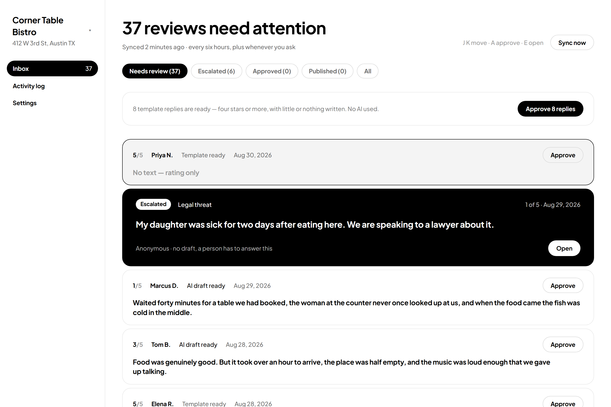
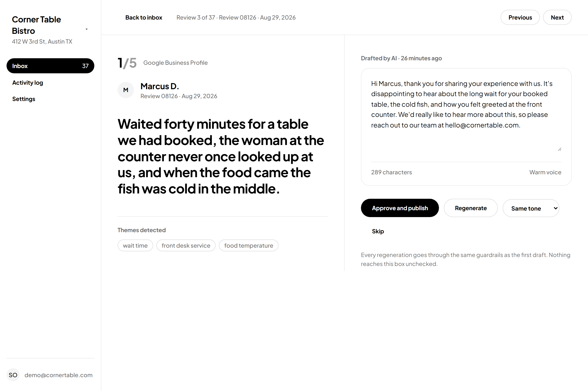
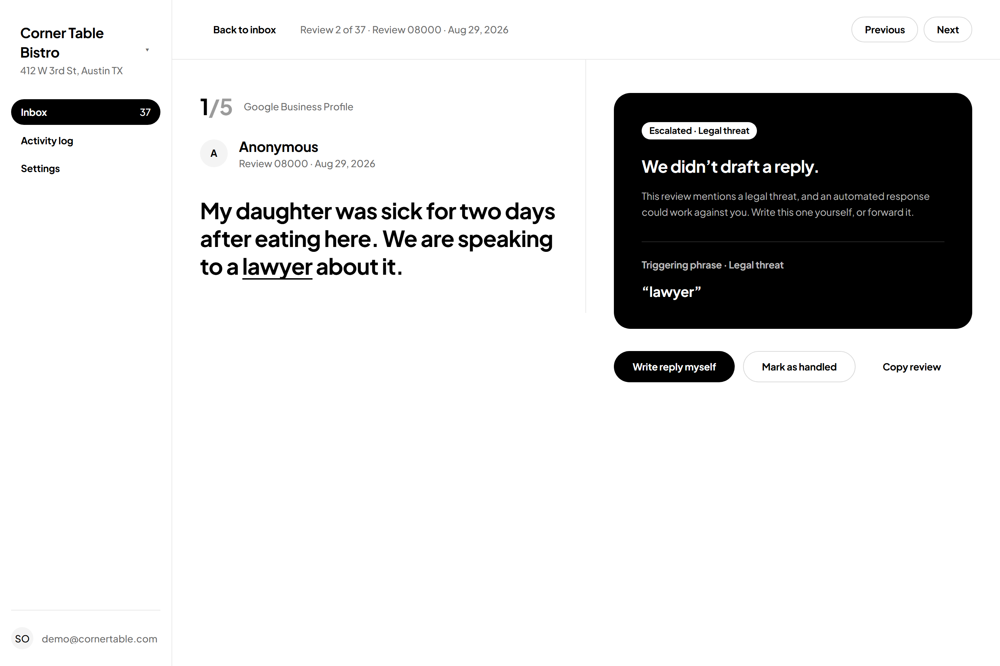
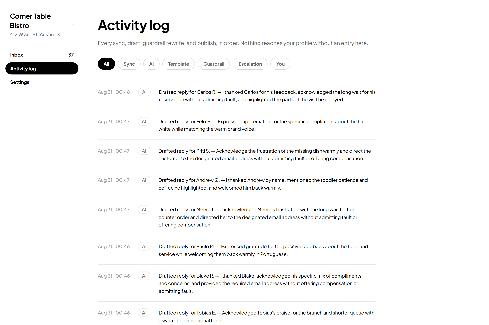

# Review Desk

Review Desk connects to a business's Google Business Profile, pulls in customer
reviews, and drafts replies with AI. A human approves every reply before it is
published, and a deterministic guardrail layer sits between the model and the
approval screen so a draft can never commit the business to a refund, an
admission of fault, or a promise it can't keep.

It solves a specific problem for a small-business owner: reviews accumulate,
answering them well takes judgement, and answering them badly in public is worse
than not answering at all. The owner opens this once or twice a week, clears a
queue in ten minutes, and leaves.

---

## Demo

```bash
git clone <this repo> && cd review-desk
npm install
cp .env.example .env   # DATABASE_URL, AUTH_SECRET, GOOGLE_GENERATIVE_AI_API_KEY
npm run db:migrate
npm run db:seed
npm run dev            # http://localhost:3000
```

`DATABASE_URL` needs a Postgres database. [Neon](https://neon.tech) gives you one
free without a card, and creating it takes about a minute —
[DEPLOYMENT.md](DEPLOYMENT.md#step-1--create-the-database) walks through it.

Sign in at `/signin` with the seeded account:

| Email                  | Password                             |
| ---------------------- | ------------------------------------ |
| `demo@cornertable.com` | `reviewdesk2026` |

Set `DEMO_PASSWORD` when seeding anything reachable from the internet — that
default is written here, so it is a published credential.

Google sign-in also works if you add OAuth credentials, but it is not needed to
review the app.

### Screenshots

**The inbox.** Template replies, an escalation, and AI drafts in one queue.



**A generated draft.** Themes extracted from the review, the brand voice named,
and the follow-up address used in place of the compensation the guardrails
forbid.



**An escalation.** No draft was written. The triggering phrase is underlined in
the review and quoted back beside it.



**The activity log.** Every sync, classification, draft and publish, including
where a published reply actually went.



> These are real screenshots of the seeded app, not mockups. In this particular
> run the model produced no guardrail violations, so no "Adjusted: …" note
> appears on the draft above — the system instruction did its job and the
> validator had nothing to catch. The repair path is exercised by the test
> suite rather than staged here.

Regenerate them with:

```bash
npm run dev
npm install --no-save playwright && npx playwright install chromium
npx tsx scripts/screenshots.mts
```

---

## The Google Business Profile constraint

**This app does not read real Google reviews, and it says so on screen.**

The Google Business Profile APIs are not openly available. Calling them requires
all of:

1. A verified Google Business Profile that you own or manage.
2. An approved access request for the Business Profile API group, submitted
   through Google's access form and granted manually, per Cloud project.
3. The `https://www.googleapis.com/auth/business.manage` OAuth scope — a
   *restricted* scope, which means OAuth verification and a security assessment
   before it can be requested from anyone outside your own organisation.

This project has none of those. Rather than fake the integration or block on an
approval process, the review source is an interface with two implementations:

```
lib/providers/
  ReviewProvider.ts                 listLocations, fetchReviews(since), publishReply
  FakeReviewProvider.ts             active by default; serves a synthetic corpus
  GoogleBusinessProfileProvider.ts  scaffolded; real endpoints in comments
```

Everything above that interface — sync, triage, drafting, guardrails,
publishing — is written against those three methods and contains no reference to
Google. Swapping providers is configuration, not a rewrite. See
[Swapping in the real provider](#swapping-in-the-real-provider).

What follows from this, stated plainly rather than hidden:

- **Google sign-in is real** and works today with `openid email profile`. The
  restricted scope is present in `lib/auth/index.ts`, commented out, with the
  reason.
- **The reviews are synthetic** — 50 of them, with a deliberate distribution.
- **Publishing is a logged no-op.** `FakeReviewProvider.publishReply` records the
  reply and returns `"Recorded locally. No reply was sent to Google — this
  profile is synthetic."` That sentence goes into the activity log verbatim, and
  the detail screen says the same thing. It does not pretend to have called
  Google.

---

## Architecture

### The four-stage pipeline

Every review passes through four stages, and **only one of them is a generative
model call**. Each stage is its own module in `lib/pipeline/`, so each is
testable alone.

```
                     ┌─────────────────────────────────────┐
   review ─────────► │ 1. Escalation gate                  │
                     │    keywords  ∪  LLM classifier      │
                     └──────────────┬──────────────────────┘
                          fires?    │ no
                             │      ▼
                             │   ┌─────────────────────────┐
                             │   │ 2. Template gate        │
                             │   │    rating ≥ 4 and       │
                             │   │    text < 40 chars      │
                             │   └──────────┬──────────────┘
                             │      fires?  │ no
                             │         │    ▼
                             │         │  ┌───────────────────────┐
                             │         │  │ 3. Generation         │
                             │         │  │    one model call     │
                             │         │  └──────────┬────────────┘
                             │         │             ▼
                             │         │  ┌───────────────────────┐
                             │         │  │ 4. Output validator   │
                             │         │  │    deterministic      │
                             │         │  │    one repair, then   │
                             │         │  │    stop               │
                             │         │  └──────────┬────────────┘
                             ▼         ▼             ▼
                       ESCALATE     TEMPLATE     GENERATE
                       no draft     canned       drafted, or
                       ever         reply        needs_manual_reply
```

| Route | When | Model calls | What the operator sees |
| --- | --- | --- | --- |
| `ESCALATE` | A trigger phrase, or the classifier above threshold | 0 or 1 (classifier only) | No draft, the triggering evidence quoted, and a prompt to write it themselves |
| `TEMPLATE` | Rating ≥ 4 and under 40 characters of text | 0 | A rotating canned thank-you, approvable in bulk |
| `GENERATE` → drafted | Everything else, validator passed | 1 or 2 | An editable draft, with a note for anything a guardrail removed |
| `GENERATE` → `needs_manual_reply` | Two attempts both broke a rule | 2 | "We couldn't draft this one within the safety rules", both attempts visible |
| `GENERATE` → paused | No API key, or the day's budget is spent | 0 | "Not screened yet" — no draft, and no claim of one |

The routing type is exactly:

```ts
type TriageRoute =
  | { route: 'ESCALATE'; category: EscalationCategory | null;
      trigger: 'keyword' | 'classifier'; evidence: string }
  | { route: 'TEMPLATE'; templateId: string }
  | { route: 'GENERATE' }
```

`category` is nullable for one reason: when the classifier call itself fails we
escalate anyway (see below) but refuse to label the review with a category we
never determined.

### Structured output, everywhere

Every model call sends `responseSchema` with
`responseMimeType: "application/json"` and validates the parsed result with Zod
before anything downstream sees it. There is no code path in this project that
parses free text or runs a regex over a model response. `lib/ai/types.ts`
deliberately exposes no method that returns a string.

Two layers, because they catch different failures: `responseSchema` constrains
decoding, Zod catches an empty reply, a confidence of `40` where `0.4` was meant,
or a category the model invented. Either failing is a *handled* outcome — the
classifier fails closed, the generator marks the review for a manual reply —
never an exception in front of a user.

### Models

| Job | Model | Why |
| --- | --- | --- |
| Escalation classifier | `gemini-3.1-flash-lite` | Runs on every review with text. One narrow question, so it goes on a small model. |
| Reply generation | `gemini-3.5-flash-lite` | Far fewer calls, and it is the text a human reads. |

Both are in `lib/config/ai.ts`; nothing else names a model.

**Quotas are per model per day, so the two jobs deliberately run on *different*
models** — that is what stops classification from eating the drafting budget,
and it was the point of the split in the first place.

> The brief specified `gemini-2.5-flash` and `gemini-2.5-flash-lite`. Neither
> works, and the second correction is the interesting one:
>
> - **2.5 is not issued to new API keys at all.** The API answers with a 404
>   pointing at the 3.5 line.
> - **`gemini-3.5-flash` allows 20 requests per day on the free tier.** Measured,
>   not guessed — a seeding run stopped dead after exactly 20 drafts and the 429
>   named the quota: `GenerateRequestsPerDayPerProjectPerModel-FreeTier,
>   quotaValue: 20`. Twenty drafts a day is not a product, so generation runs on
>   the lite model, which has real headroom.

### Free-tier discipline

Google no longer publishes per-model free-tier numbers in its docs; they are
shown per account in AI Studio and they move. So nothing here is built against a
specific number:

- **Serialized queue.** Every call joins one promise chain with a minimum gap
  (`AI_MIN_DELAY_MS`, default 6.5s ≈ 9/min). This app never fans out parallel LLM
  requests, so requests-per-minute is handled by construction rather than by
  reacting to 429s.
- **Exponential backoff with jitter**, capped attempts, then a readable failure.
- **A daily counter in the database**, checked before each call. When it is spent
  the UI says `AI drafts paused — daily limit reached, resuming at midnight
  Pacific` and template routing carries on, because it costs nothing.
- **The real quota is learned from the first 429**, which states it exactly, and
  the app budgets against that from then on. This is here because the first
  version of the config guessed 200 a day for the generation model and the true
  figure was 20 — a guess with a shelf life is worse than reading the answer.
  A 429 naming a *daily* cap also stops the run rather than being retried into:
  a day's quota does not clear in thirty seconds of backoff.
- **Classification is cached forever.** A review is classified once, ever; a
  re-sync spends nothing.
- **`TEMPLATE` and `ESCALATE` never reach the generator.** Asserted in the tests.

> The brief said the daily quota resets at 00:00 UTC. It resets at **midnight
> Pacific** — so `AiUsageCounter` is keyed by the Pacific date and the UI quotes
> Pacific. Getting this wrong would have paused drafting for up to eight hours
> longer than necessary every day.

### Data model

`Organization → User → Location → Review`, plus `Draft`, `GuardrailEvent`,
`SyncJob`, `ActivityLog`, `BrandVoice`, `AiUsageCounter`, and the Auth.js
adapter tables.

Two things worth calling out:

- **`Draft` holds every attempt**, not just the winner: the raw model output, the
  validated output, and the human edit are separate columns, with a `source` of
  `AI | TEMPLATE | HUMAN`. The UI distinguishes machine text from human text, so
  the schema has to as well. When both generation attempts fail, both rows stay,
  neither is current, and the screen can show what was tried.
- **No `enum` blocks and no scalar lists.** SQLite supports neither, so keeping
  them out let the same schema run on both dialects with a one-line change —
  which is exactly what the move to Postgres turned out to be. The closed sets
  live in `lib/constants.ts` as union types.

### Multi-tenancy

Every query is scoped by an organization ID that comes from the session and
never from a request parameter. That is enforced by one helper, `lib/tenancy.ts`,
and any review ID arriving from the client goes through `assertOwnsReview` before
anything is done to it.

The active *location* is deliberately read from the database rather than the
session token: it changes whenever the user picks another one from the sidebar,
and a JWT is only re-issued at sign-in.

---

## The guardrail system

### What escalates

The gate has two sources, combined as a union so recall stays high. A keyword hit
escalates immediately and skips the classifier entirely, which is both faster and
free.

**22 trigger phrases**, matched on word boundaries against normalized text, and
the matched span is stored verbatim so the detail screen can underline it:

| Category | Phrases |
| --- | --- |
| `LEGAL_THREAT` | lawyer, attorney, sue, suing, legal action, small claims |
| `HEALTH_SAFETY` | food poisoning, hospital, ambulance, allergic reaction, contamination, rodent, cockroach |
| `DISCRIMINATION` | racist, racial, discriminated, refused to serve |
| `PHYSICAL_HARM` | assaulted, groped |
| `STAFF_MISCONDUCT` | stole, theft, police |
| `MINOR_SAFETY` | *(none — see below)* |

`MINOR_SAFETY` has no keywords on purpose: no short phrase reliably means "a
child was put at risk" without catching every review that mentions children, so
that category is left entirely to the classifier.

**The classifier** covers the same intents in language no list anticipates,
returning `{ category, confidence, evidence }` where `evidence` must be a
verbatim span. If the model paraphrases instead of quoting, the evidence is
dropped rather than shown as a quotation the customer never wrote. The threshold
is low on purpose (`0.4`): a false escalation costs the owner a minute, a missed
one can cost a lawsuit.

### What happens on failure

This distinction matters and is easy to get wrong:

- **A classifier call that runs and fails** — timeout, 5xx, unusable JSON —
  **escalates.** Fail closed. The review goes to a human with the reason
  attached and no draft is generated.
- **A classifier that cannot run at all** — no API key, or the day's budget is
  spent — **does not escalate.** It reports the review as unscreened and leaves
  it untriaged so the next sync picks it up.

Conflating those two would mark every review in the queue an escalation the
moment a key went missing, including the five-star ones. That is not a safe
default, it is a wrong one, and it would teach the owner to ignore the
escalation badge — which is the one thing the badge cannot afford.

### What is blocked in a generated reply

The validator is deterministic regex over the generated text, run before a human
ever sees it, on every generated reply including regenerations.

| Rule | Catches |
| --- | --- |
| `NO_COMPENSATION` | refund, reimburse, discount, voucher, comp(ed), free meal/drink/dessert/item, compensate, credit, gift card, on us, on the house, no charge, waive, money back |
| `NO_FAULT` | our fault, we were negligent, we failed to, this was a violation, we broke, we are liable, we admit, we take responsibility, you're right we… |
| `NO_GUARANTEE` | will never happen again, we guarantee, I promise, you have my word, rest assured |
| `NO_NAMES` | any capitalized first name that is not the business name or the reviewer's |

Two deliberate design decisions:

- **Declining money is not committing money.** "We are not able to offer a
  refund" passes; "your next dessert is on us" does not. The exemption is scoped
  tightly enough that "we can't wait to give you a free dessert" is still caught.
- **`NO_NAMES` over-triggers slightly.** There is no way to identify a first name
  by regex, so the rule is "a capitalized word mid-sentence, minus a stoplist".
  Over-triggering costs one repair call. Under-triggering puts an employee's name
  on a public profile.

**On a violation: exactly one repair attempt**, re-prompted with the specific
rule and the offending sentence quoted. If the second attempt also violates, we
stop — never a third — and the review becomes `needs_manual_reply` with both
attempts kept and shown. Every repair is recorded and surfaced under the draft as
`Adjusted: an offer of compensation was removed.` with a diff of what was removed
and what was written instead.

### The tests

```bash
npm test
```

**80 cases** in `lib/pipeline/__tests__/guardrails.test.ts`, running against
fixed fixtures with a scripted model. No network, no API key, no flake — the
suite runs in under a second, so it can gate every commit.

Covered:

- Every one of the 22 keyword triggers fires, with **zero** model calls
- Each escalation category routes correctly, including six free-language cases
  with no trigger keyword (asserted keyword-free as a precondition)
- Word-boundary matching: "assuming" does not trip "sue"
- A classifier failure escalates; a classifier that cannot run does not
- Paraphrased evidence is dropped; re-cased evidence is recovered
- A cached classification costs nothing
- Template gate boundaries: 4★ empty, 5★ 39 chars, 5★ 41 chars, 3★ empty
- Every validator category catches its violation, and a non-committing mention of
  "refund" does not
- Auto-repair succeeds on attempt two, and reports what changed
- Auto-repair fails twice → `needs_manual_reply`, with **exactly two** calls
- Regressions for two bugs the live seeding run found and the unit tests had
  not: a sentence splitter that broke on the dot inside an email address, and a
  name check that flagged the first word of a Spanish sentence
- **Escalated reviews never reach the generator** — asserted directly on the mock

That last one is the assertion the whole design exists to make true.

---

## Setup

### Prerequisites

Node.js 20+ and a Postgres database. Neon's free tier needs no card, and
`lib/db.ts` chooses its driver from the connection string, so pointing
`DATABASE_URL` at a local Postgres works just as well.

### Environment

`cp .env.example to .env`. Every value is documented there; the two that matter:

- **`DATABASE_URL`** — required. The pooled connection string if your provider
  offers one. Add `DIRECT_DATABASE_URL` too if it does: migrations need a direct
  connection, and `prisma.config.ts` picks it up automatically.
- **`AUTH_SECRET`** — required. Generate with `npx auth secret`.
- **`GOOGLE_GENERATIVE_AI_API_KEY`** — free, no credit card, from
  [aistudio.google.com/apikey](https://aistudio.google.com/apikey). Without it
  the app still runs: template replies and keyword escalations work exactly as
  normal because neither costs anything, and reviews needing a written reply are
  reported as waiting rather than given an invented draft.

Optional: `AUTH_GOOGLE_ID` / `AUTH_GOOGLE_SECRET` to enable Google sign-in.
Create an OAuth client at
[console.cloud.google.com](https://console.cloud.google.com) → APIs & Services →
Credentials → OAuth client ID → Web application, with redirect URI
`http://localhost:3000/api/auth/callback/google`. Only basic scopes are
requested.

### Commands

```bash
npm run db:migrate    # create the database
npm run db:seed       # provision the demo tenant and ingest 50 reviews
npm run dev
npm test              # the guardrail suite
npm run lint
npm run build
```

> **Deploying this to a real URL?** [DEPLOYMENT.md](DEPLOYMENT.md) is the
> step-by-step: Neon, the Postgres migration switch, OAuth credentials, Vercel
> environment variables, the scheduled sync, and a verification checklist.

`db:seed` runs the **real sync path** — the same enqueue, fetch, upsert, triage
and log that the `Sync now` button uses. It writes no reviews, drafts or
guardrail events directly. A good-looking inbox after seeding is therefore
evidence the pipeline works, which a hand-written fixture set would not be. It
also means seeding makes real model calls and takes a few minutes at free-tier
pacing.

The seeded corpus is 50 reviews across two locations, distributed on purpose:

- 12 four- and five-star with nothing or almost nothing written → template lane
- 6 escalations, one per category, **three with no trigger phrase** so the
  classifier has to earn them
- 8 with several complaints in one review, to exercise theme extraction
- 3 written in Spanish, French and Portuguese
- 21 spread across the remaining ratings and tones

Dates are spread over the last 90 days. The distribution is fixed and the time of
day comes from a seeded PRNG, so two seed runs produce the same ordering.

---

## Swapping in the real provider

Once Business Profile API access is granted, in order:

1. **Enable the APIs** in your Google Cloud project: My Business Account
   Management, My Business Business Information, and My Business (v4, for
   reviews).
2. **Uncomment the scope** in `lib/auth/index.ts` — the `business.manage` line is
   already there with an explanation. Re-consent existing users.
3. **Store the access token.** The Prisma adapter already persists
   `access_token` and `refresh_token` on `Account`; add refresh-on-expiry to the
   `jwt` callback.
4. **Implement the three methods** in `GoogleBusinessProfileProvider.ts`. Each
   one carries its endpoint, query parameters, response mapping and known
   gotchas as comments — `starRating` is an enum not an integer, `comment` is
   absent on rating-only reviews, and there is no server-side "modified since"
   filter so the watermark is applied while paging.
5. **Set `REVIEW_PROVIDER=google`** and pass the token and account name into
   `getReviewProvider()` in `lib/providers/index.ts`.
6. **Delete nothing else.** No other file references Google.

Until step 4 is done, every method throws `NotImplementedError` naming the
missing access — loudly, rather than silently falling back to synthetic data and
looking like it worked.

---

## Scheduling

The sync endpoint is `POST /api/cron/sync`, protected by a shared secret in the
`x-cron-secret` header and compared in constant time. An unset `CRON_SECRET`
means *nobody* gets in, never everybody.

**The schedule lives in GitHub Actions** — `.github/workflows/sync.yml`, every
six hours. This is deliberate: **Vercel's Hobby plan allows cron jobs at a
once-per-day frequency only**, which is too coarse for a review queue. Actions is
free at any frequency and demonstrates the same external-trigger pattern.

To use it, set two repository secrets: `APP_URL` and `CRON_SECRET` (walked
through in [DEPLOYMENT.md](DEPLOYMENT.md#step-8--schedule-the-sync)). To change the
frequency, edit the cron expression. To move to Vercel Cron instead, add to
`vercel.json`:

```json
{ "crons": [{ "path": "/api/cron/sync", "schedule": "0 3 * * *" }] }
```

…and be aware that daily is the Hobby ceiling.

The `Sync now` button works regardless of schedule, and the inbox shows the
relative time of the last successful sync.

---

## Cost

The entire stack runs on free tiers with no credit card:

| | Free tier | Where the limit bites |
| --- | --- | --- |
| Vercel Hobby | Free | Cron limited to once per day — hence GitHub Actions |
| Neon Postgres | Free, no card | 0.5 GB storage; the app suspends when idle and takes a second to wake |
| Gemini API | Free, no card | Per-day and per-minute request caps that Google no longer publishes; the app budgets conservatively and degrades visibly |
| GitHub Actions | Free | Unlimited minutes on public repos |
| Auth.js, Prisma | Free | — |

Nothing in this project will start billing you.

---

## Out of scope for the MVP

Chosen, not overlooked:

- **Self-service registration.** There is no sign-up form; accounts come from the
  seed or from Google sign-in.
- **Email verification and password reset.** No mail provider is wired up.
- **Billing and plans.**
- **Team invitations.** The schema supports many users per organization; there is
  no UI to invite one.
- **Review analytics.** Themes are extracted and displayed per review, but not
  aggregated into trends.
- **Editing the guardrail list.** The four rules are fixed and read-only — they
  are the product's safety claim, not a preference.

---

## Layout

```
app/
  (desk)/            inbox, review detail, settings, activity — behind auth
  api/auth/          Auth.js route handler
  api/cron/sync/     the scheduled sync trigger
  onboarding/        location and brand voice, on first sign-in
  signin/            Google and email/password
  tokens/            design tokens, one file per axis
components/
  ds/                design system primitives
  app/                desk components
lib/
  pipeline/          the four stages, and their test suite
  providers/         the review source interface and its two implementations
  ai/                the Gemini client: queue, backoff, budget, schemas
  sync/              the sync job and how a pipeline result is persisted
  config/            models, escalation vocabulary, templates, brand voice
  tenancy.ts         the one place an organization ID enters the app
  actions.ts         every mutation, as server actions
prisma/
  schema.prisma      the data model
  seed.ts            provisions a tenant, then ingests through the real sync
```

Two notes on structure. There is no `proxy.ts` (Next 16's rename of
`middleware.ts`): Next's own documentation says proxy runs before the cache and
is the wrong place for session management, so authorization happens in the desk
layout and in every server action, against the same session in the same request.
And `/design-system` is a token reference sheet, deliberately unlinked from the
product chrome.
